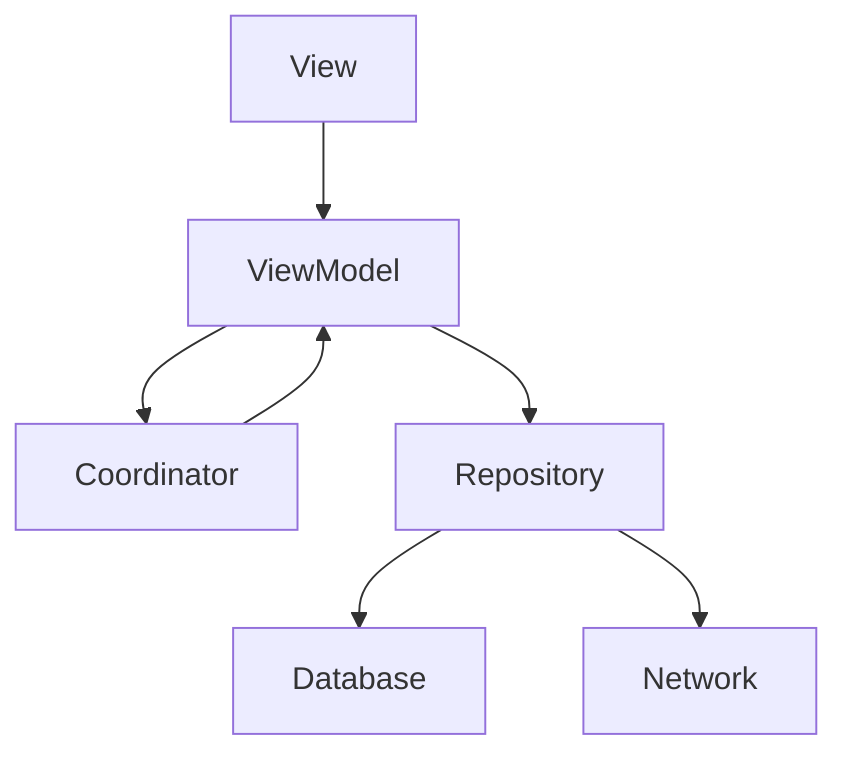

# MVVM-Clean
This repository is the practice for mvvm clean architect using swift 

Model ViewModel Controller Coordinator Container(DI)

Following Patterns are used in this repository

# Coordinator 
Responsible to navigate to next Controller. Imagine you want to navigate to X scene from Y scene. 
you have to make sure that you binds every dependency object and even dependent object might need any dependency. So you have to fulfil nested dependency.
From SOLID prespective if we handle navigational responsibility on viewController we violates S (Single Responsibility principle). Also it handle duplicate code meaning handling centralized event

This creates a problem that unnecessary layers are exposed which should not be known by the particular layer. For example ViewController should not know about repository.
Further it also resolve tight coupling and creates testable and maintainable code base. Remember dependent object should be provided from outside so they are 
also testable. Avoid using Concrete types for example any particular class type instead follow Protocol Oriented Programming and abstract your layers, so when the requirement changes your code still works smoothly and make sure we follow OL principle of SOLID

# Container(DI)
At certain time tester want to test with dummy data. How can you write such flexible code. Container make sure that we can give any implementation for abstraction object
For example viewController depends on viewModel, viewModel depends on Repository and coordinator.
Let assume we want to make dummy repository which doesnot communicate with server instead it returns dummy data may be hardcode or read from local json file.
This particular step is needed when we are testing and we need to test with mock data.

We have  abstracted the dependent object through out the app and make sured that object graph works with any implementation of dependent object.
So container is responsible to create all the dependent- nested dependent object and bind it to layer and gives you scene(ViewController) object.

So we can create multiple DI layers and change our any dependent object with any implementation and app will still be runing fine.

# ViewModel
This layer contains the business logic of the view. Make sure donot write any UI part in this layer. First of all we make protocol of viewModel
and then make our implementations. Our Views are losely couple as they depends on Protocols. View updates event to viewModel and ViewModel runs business logic
and after completion callback it funcs to update view. If your controller has two views for example viewController and tableview make sure you have different 
ViewModel for both of these. One for viewcontroller.view and for tableviewCell. 

some of the properties are created using Entity(Business Model). we make sure that we have applied formatters and view will directly use these values to display
without being doing any calculations.

# Repository
This is the layer from where the data has been fetched and return to viewModel. Makesure you follow Protocol Oriented approach for losely coupled.
Repository can decide from where to fetch it can fetch from server or from local storage such as coredata. If we support offline mode then we save response to local storage so that 
next time it will save network calls and will be fast. Repository depends on two Network Manager and Database Manager

# NetworkManager
this is the centralized place where all the network calls are handled. You can apply limits in order for any number of network calls for concurrently
Make sure you make protocol layer and then implement manager as implementation of protocol

# Database
 this is the local storage system and can CRUD create read update and delete records. Make sure you follow protocol approach. There can be numerous
database for example coredatabase, sqlite, UserDefaults, Keychain. You should make sure any database type should provide these basic funcs.

Entity: These are basic Models which we get in response from server communication.

For moving from one scene to other Scene

event occur on view which updates viewModel - viewModel updates coordinator - coordinator act accordingly move to nextController or pop current controller.

